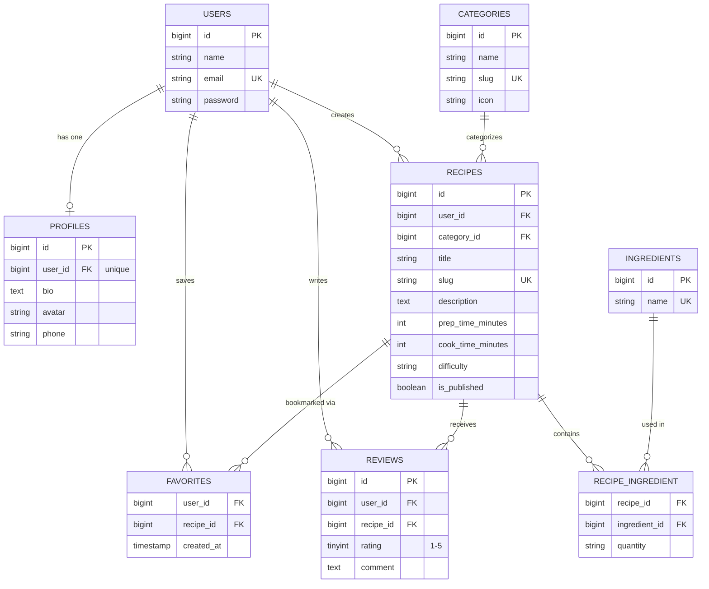

# Database Design - Entity Relationship Diagram (ERD)

This document describes the database schema of **Recipe App** and every Eloquent relationship used in the project.

## 1. Entity Relationship Diagram

## 2. Relationship Summary

| Type | Relationship | Eloquent |
|---|---|---|
| One-to-One | `User` ↔ `Profile` | `hasOne` / `belongsTo` |
| One-to-Many | `User` → `Recipe` | `hasMany` / `belongsTo` |
| One-to-Many | `User` → `Review` | `hasMany` / `belongsTo` |
| One-to-Many | `Category` → `Recipe` | `hasMany` / `belongsTo` |
| One-to-Many | `Recipe` → `Review` | `hasMany` / `belongsTo` |
| Many-to-Many + pivot data | `Recipe` ↔ `Ingredient` (pivot `recipe_ingredient`, column `quantity`) | `belongsToMany` + `withPivot` |
| Many-to-Many + pivot data | `User` ↔ `Recipe` (pivot `favorites`, column `created_at`) | `belongsToMany` + `withPivot` |
| Has-Many-Through | `User` → `Review` through `Recipe` | `hasManyThrough` |
| Has-Many-Through | `Category` → `Review` through `Recipe` | `hasManyThrough` |

## 3. Categories (seeded)

The `categories` table is populated by a seeder with built-in themes:

| Name | Slug |
|---|---|
| Main Course | `main-course` |
| Desserts & Pastry | `desserts-pastry` |
| Beverages | `beverages` |
| Appetizers | `appetizers` |
| Healthy Food | `healthy-food` |
| Quick & Easy | `quick-easy` |

## 4. Design Notes

- **Unique constraints:** `profiles.user_id`, `categories.slug`, `recipes.slug`, `ingredients.name`, and (`favorites.user_id`, `favorites.recipe_id`) so a user can favorite a recipe only once.
- **Recipe ↔ Review link:** `reviews.user_id` and `reviews.recipe_id` allow users to leave a feedback on recipes.
- **Cascade rules:** deleting a user cascades to their profile, recipes, reviews, and favorites. Deleting a category is restricted while recipes still use it.
- **Ratings** are calculated dynamically from `reviews.rating` and are not stored directly in the `recipes` table.